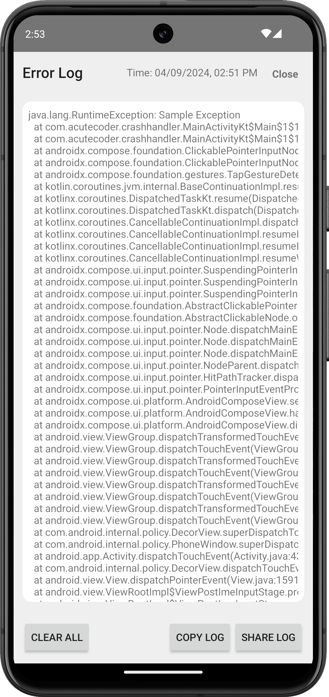
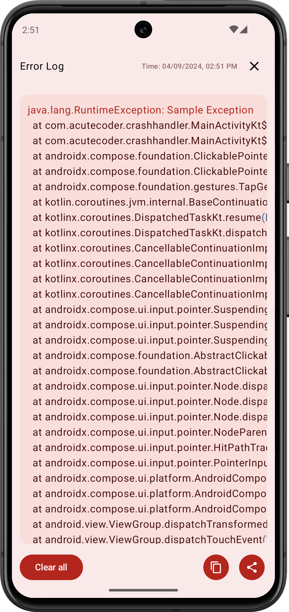

# Crash handler
A Crash Handling library for Android projects that automatically stores all crash logs in a file until intentionally cleared. It also records the time of the last exception, making it easy to review and debug issues by sharing the logs.
<br>
## Screenshots
  [](## "Default Crash Handler")  [](## "Custom Crash Handler")

## Contents:<br>
<a href="#1-setup">1. Setup</a><br>
&nbsp;&nbsp;&nbsp;&nbsp;<a href="#11-gradle---kotlin-dsl">1.1 Kotlin DSL</a><br>
&nbsp;&nbsp;&nbsp;&nbsp;<a href="#12-gradle---groovy-dsl">1.2 Groovy DSL</a><br>
<a href="#2-usage">2. Usage</a><br>
&nbsp;&nbsp;&nbsp;&nbsp;<a href="#21-default-crash-handler">2.1 Default Crash Hanlder</a><br>
&nbsp;&nbsp;&nbsp;&nbsp;<a href="#22-default-formatter-and-logger">2.2 Default Formatter and Logger</a><br>
&nbsp;&nbsp;&nbsp;&nbsp;<a href="#23-restart-after-crash">2.3 Restart after crash</a><br>
&nbsp;&nbsp;&nbsp;&nbsp;<a href="#24-custom-crash-handler">2.4 Custom Crash handler</a><br>
&nbsp;&nbsp;&nbsp;&nbsp;<a href="#25-loading-crash-data-in-activity">2.5 Loading Crash data in Activity</a><br>
<a href="#2-usage">3. Custom Crash Handler UI</a><br>
&nbsp;&nbsp;&nbsp;&nbsp;<a href="#31-custom-activity-implementation">3.1 Custom Activity Implementation</a> or <a href="crashhandler/src/main/java/com/acutecoder/crashhandler/CrashHandlerActivity.kt">See File</a><br>
&nbsp;&nbsp;&nbsp;&nbsp;<a href="#32-custom-activity-implementation-for-compose">3.2 Custom Activity Implementation for Compose</a> or <a href="app/src/main/java/com/acutecoder/crashhandler/CustomCrashHandlerActivity.kt">See File</a><br>
<a href="#4-license">4. License</a>
<hr>
<br>

## 1. Setup

### 1.1 Gradle - Kotlin DSL
Step 1: Project level build.gradle.kts / settings.gradle.kts
<pre>
dependencyResolutionManagement {
    repositoriesMode.set(RepositoriesMode.FAIL_ON_PROJECT_REPOS)
    repositories {
        mavenCentral()
        <b>maven("https://jitpack.io")</b>
    }
}
</pre>

Step 2: Module level build.gradle<br>
<pre>
dependencies {
    <b>implementation("com.github.Bhuvaneshw:CrashHandler:<i>$version</i>")</b>
}
</pre>
Replace <b>$version</b> with latest version<br>
Latest Version: <br>
[](https://jitpack.io/#Bhuvaneshw/CrashHandler)<br><br>
<b>Example:</b>
<pre>
dependencies {
    <b>implementation("com.github.Bhuvaneshw:CrashHandler:1.0.0")</b>
}
</pre>

### 1.2 Gradle - Groovy DSL
Step 1: Project level build.gradle / settings.gradle
<pre>
dependencyResolutionManagement {
    repositoriesMode.set(RepositoriesMode.FAIL_ON_PROJECT_REPOS)
    repositories {
        mavenCentral()
        <b>maven { url 'https://jitpack.io' }</b>
    }
}
</pre>

Step 2: Module level build.gradle<br>
<pre>
dependencies {
    <b>implementation 'com.github.Bhuvaneshw:CrashHandler:<i>$version</i>'</b>
}
</pre>
<hr>
<br>

## 2. Usage
### 2.1 Default Crash handler

Extend Application with CrashHandlerApplication and call installCrashHandler()
<br><br>
Koltin
<pre>
class MyApp : CrashHandlerApplication() {
    init {
        installCrashHandler()
  
        //OR
        // installCrashHandler(
        //    thread = Thread.currentThread(),
        //    messageFormatter = DefaultErrorMessageFormatter,
        //    callback = null,
        //    logger = AndroidErrorLogger(),
        //)
    }
}
</pre>
<br>

Java
<pre>
public class MyApp extends CrashHandlerApplication {
    @Override
    public void onCreate() {
        super.onCreate();
        initCrashHandler();

        //OR
        //initCrashHandler(Thread.currentThread(), DefaultErrorMessageFormatter.INSTANCE, new RestartAppCallback(this), new AndroidErrorLogger());
    }
}
</pre>
<br>
Register in AndroidManifiest
<pre>
&lt;application
        <b>android:name=".MyApp"</b>
        ...&gt;
    ...
&lt;/application&gt;
</pre>
<br>

> [!NOTE]
> This default handler will not restart app after crash. See [Restart after crash](#22-restart-after-crash) section

<br>

### 2.2 Default Formatter and Logger
You can provide Custom Formatter by extending [ErrorMessageFormatter](crashhandler/src/main/java/com/acutecoder/crashhandler/formatter/ErrorMessageFormatter.java) and pass it in [installCrashHandler](#21-default-crash-handler)
You can provide Custom Logger by extending [CrashLogger](crashhandler/src/main/java/com/acutecoder/crashhandler/logger/CrashLogger.java) and pass it in [installCrashHandler](#21-default-crash-handler)

> [!NOTE]
> The default formatter is [DefaultErrorMessageFormatter](crashhandler/src/main/java/com/acutecoder/crashhandler/formatter/DefaultErrorMessageFormatter.kt) and the default logger is [AndroidErrorLogger](crashhandler/src/main/java/com/acutecoder/crashhandler/logger/AndroidErrorLogger.kt)

<br>

### 2.3 Restart after crash

Provide RestartAppCallback() while initializing the crash handler
<br><br>
Kotlin
<pre>
class MyApp : CrashHandlerApplication() {
    init {
        installCrashHandler(<b>callback = RestartAppCallback(this)</b>)
    }
}
</pre>
<br>

Java
<pre>
public class MyApp extends CrashHandlerApplication {
    @Override
    public void onCreate() {
        super.onCreate();

        initCrashHandler(
          Thread.currentThread(), 
          DefaultErrorMessageFormatter.INSTANCE,
          <b>new RestartAppCallback(this)</b>,
          new AndroidErrorLogger()
        );
    }
}
</pre>
<br>

### 2.4 Custom Crash Handler

Override startCrashHandlerActivity() and provide your custom activity class
<br><br>
Kotlin
<pre>
class CustomCrashHandlerApp : CrashHandlerApplication() {

    init {
        installCrashHandler()
    }

    override fun startCrashHandlerActivity(defaultActivityClass: Class<*>) {
        super.startCrashHandlerActivity(CustomCrashHandlerActivity::class.java) // Provide your custom activity class
    }

}
</pre>
<br>

Java
<pre>

public class DefaultCrashHandlerApp extends CrashHandlerApplication {

    @Override
    public void onCreate() {
        super.onCreate();
        initCrashHandler();
    }

    @Override
    protected void startCrashHandlerActivity(@NonNull Class<?> defaultActivityClass) {
        super.startCrashHandlerActivity(CustomCrashHandlerActivity.class); // Provide your custom activity class
    }
}

</pre>
<br>

### 2.5 Loading crash data in Activity
> [!CAUTION]
> Calling loadErrorLog() on main thread is not allowed, throws ReadLogOnMainThreadException. 
<br>

Kotlin
<pre>
val log: ErrorLog = crashHandler.loadErrorLog()
val errors: MutableList<String>? = log.errors
val simplifiedLog: String = log.simplifiedLog()
val lastErrorTime: String? = log.lastErrorTime
</pre>
> [!TIP]
> Using coroutine with IO dispatcher is recommended
<br>

Java
<pre>
ErrorLog log = CrashHandlerUtilsKt.getCrashHandler(context).loadErrorLog();
//Works only when the context.applicationContext is an instance of CrashHandler,
//i.e The application must implement CrashHandler, like extending CrashHandlerApplication
List<String> errors = log.getErrors();
String simplifiedLog = log.simplifiedLog();
String lastErrorTime = log.getLastErrorTime();
</pre>

## 3. Custom Crash Handler UI

### 3.1 Custom Activity Implementation
> [!NOTE]
> For more details see the [CrashHandlerActivity](crashhandler/src/main/java/com/acutecoder/crashhandler/CrashHandlerActivity.kt) implementation.
<br>

### 3.2 Custom Activity Implementation for Compose
> [!NOTE]
> If you are using compose in your project see [CustomCrashHandlerActivity](app/src/main/java/com/acutecoder/crashhandler/CustomCrashHandlerActivity.kt) for implementation.
<br>


## 4. License
```
    CrashHandler - Crash Handling Library
    Copyright (C) 2024  Bhuvaneshwaran

    This program is free software: you can redistribute it and/or modify
    it under the terms of the GNU General Public License as published by
    the Free Software Foundation, either version 3 of the License, or
    (at your option) any later version.

    This program is distributed in the hope that it will be useful,
    but WITHOUT ANY WARRANTY; without even the implied warranty of
    MERCHANTABILITY or FITNESS FOR A PARTICULAR PURPOSE.  See the
    GNU General Public License for more details.

    You should have received a copy of the GNU General Public License
    along with this program.  If not, see <https://www.gnu.org/licenses/>.
```
